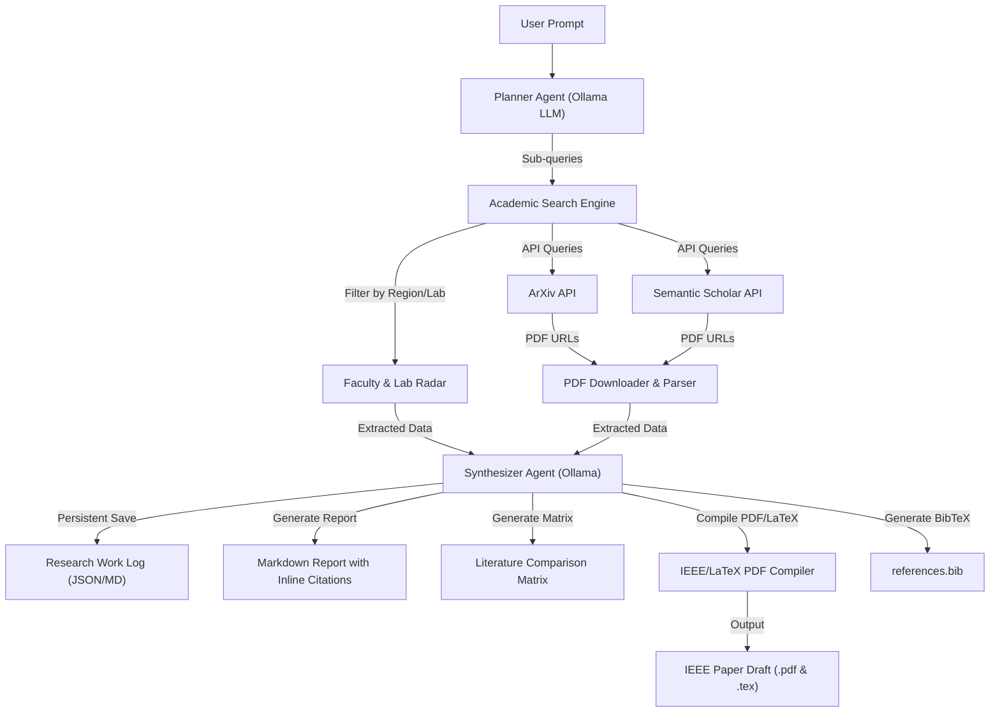

# 📑 Product Requirements Document (PRD)
# AI Academic Research Agent

> **Author:** Nirmiti R. Tamore  
> **Project:** Stage 2 — Autonomous AI Academic Literature Reviewer, Faculty Radar & IEEE PDF Paper Compiler  
> **Target Use-Case:** Autonomous literature review, faculty/lab tracking, persistent research logging, IEEE/LaTeX paper draft compilation, and paper comparison for Japanese Master's Admissions & Academic Research Proposals.

---

## 🎯 1. Product Vision & Objective

The **AI Academic Research Agent** is an autonomous multi-step research assistant tailored specifically for academic researchers, graduate applicants, and system engineers. Powered by **100% local Ollama LLMs** (with optional cloud fallback), it interfaces directly with peer-reviewed academic literature repositories (ArXiv, Semantic Scholar, IEEE Xplore, Google Scholar) to extract paper abstracts, methodology sections, benchmark datasets, and algorithm details, synthesizing them into comprehensive, fully-cited research reports, persistent research work logs, and **compiled IEEE/LaTeX paper drafts**.

---

## 👥 2. Target Personas & Primary Use Cases

1. **Graduate Applicants & Master's Students:** Rapidly synthesize state-of-the-art literature for SOP & Research Proposal preparation, and track active faculty/labs in Japan working on matching research topics.
2. **Academic Researchers & Authors:** Maintain a persistent **Research Work Log**, generate literature review matrices, and export preliminary paper drafts formatted in standard **IEEE / ACM journal templates (PDF + LaTeX .tex)**.
3. **System Architects:** Compare distributed consensus algorithms, fault-tolerance paradigms, and agent execution models across academic publications.

---

## 🚀 3. Core Functional Requirements

### F1: Multi-Source Academic Scraping Engine
- **ArXiv API Integration:** Query computer science (cs.DC, cs.AI, cs.SE) preprints, fetch paper metadata, abstracts, and PDF links.
- **Semantic Scholar API Integration:** Query paper citations, h-index, influential citations, and graph relationships.
- **PDF Extraction Engine:** Direct PDF download and text parsing via `pdfplumber` / PyPDF to extract methodology, algorithms, and evaluation sections.

### F2: Local LLM Synthesis Pipeline (Ollama Native)
- **Local Privacy & Zero-Cost:** Powered natively by local **Ollama** models (`llama3.2`, `mistral`, `qwen2.5`). Optional fallback to Gemini/OpenAI APIs.
- **Planner Agent:** Deconstructs a high-level research prompt into $N$ targeted academic search queries.
- **Scraper / Extraction Agents:** Concurrent execution across APIs and paper PDFs.
- **Synthesis Agent:** Aggregates findings, deduplicates references, filters out hallucinated citations, and formats output.

### F3: Literature Review Matrix Generator
- Automatic table generation summarizing key parameters across analyzed papers:
  - *Author & Year*
  - *Core Methodology / Consensus Mechanism*
  - *Evaluation Metrics & Datasets*
  - *Limitations & Future Scope*

### F4: BibTeX & IEEE / ACM LaTeX PDF Compiler
- **BibTeX Export:** Automatic extraction and formatting of `.bib` citation entries.
- **IEEE / Journal Paper Generator:** Compiles literature analysis into a formal **IEEE 2-column LaTeX draft (`.tex`)** and converts it into a ready-to-read **PDF report**.
- **Template Sections:** Pre-populates *Abstract, Introduction, Related Work / Literature Survey, Comparative Analysis, Methodology Framework*, and *References*.

### F5: Faculty & Regional Research Radar (Professor & Lab Tracker)
- **Geographic & University Filter:** Target queries by country/region (e.g., *Japan*, *Imperial Universities*, *EU*) or specific institutional affiliations.
- **Professor & Lab Profiling:** Identifies top active principal investigators (PIs) and laboratories publishing in the chosen research domain (2024–2026).
- **Recent Breakthrough Summarizer:** Synthesizes the latest 3–5 publications from identified professors.

### F6: Persistent Research Work Log & Session History
- Maintains a persistent `research_log.json` recording every topic searched, papers parsed, synthesized notes, and professor discoveries over time.

---

## 🛠️ 4. Technical Architecture & Tech Stack

- **LLM Engine:** **Ollama Local LLM** (`llama3.2`, `mistral`, `qwen2.5`) via `http://localhost:11434`. (Optional Gemini/OpenAI API support).
- **Backend Framework:** Python 3.11+, FastAPI (asynchronous execution)
- **Scraping & Parsing:** `arxiv`, `requests`, `aiohttp`, `pdfplumber`
- **PDF Compilation:** `weasyprint` / `reportlab` / `pdflatex`
- **Containerization:** Docker & Docker Compose

---

## 📈 5. Success Metrics & Key Performance Indicators (KPIs)

- **Privacy & Independence:** 100% local synthesis using Ollama without sending sensitive research queries to third-party APIs.
- **Search Accuracy:** 100% verified academic citations (zero hallucinated paper titles/URLs).
- **Faculty Tracking Precision:** Accurately maps top publishing professors in Japan to relevant CS research domains.
- **Document Output:** Generates valid, parseable IEEE-styled `.tex` and `.pdf` files.
