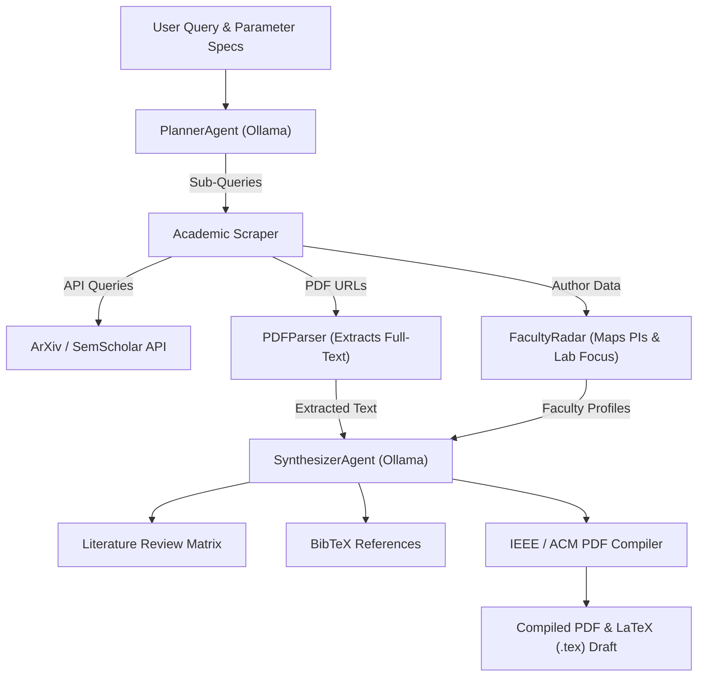

# 🔬 AI Academic Research Agent

<p align="center">
  
  
  
  
  
</p>

> An autonomous multi-agent academic research assistant powered natively by **local Ollama LLMs**. It queries peer-reviewed literature repositories (ArXiv, Semantic Scholar), parses paper PDFs, tracks active faculty/labs by region (e.g. Japan), maintains a persistent **Research Work Log**, and compiles formal **IEEE / ACM styled LaTeX and PDF paper drafts**.

---

## 🛠️ Technical Stack

- **Core Runtime:** Python 3.11+ / FastAPI (Asynchronous Execution)
- **Local LLM Engine:** Ollama (`llama3.2`, `mistral`, `qwen2.5`) via `http://localhost:11434`
- **Academic Scrapers:** ArXiv API, Semantic Scholar Graph API
- **PDF Extraction:** `pdfplumber` / PyPDF
- **Document Compilers:** ReportLab (PDF Exporter) & `IEEEtran` LaTeX Generator
- **Frontend Console:** Industry Blueprint UI with Marked.js Markdown/Table rendering

---

## ✨ Core Features & Architecture

### 1. 🏠 100% Local & Private (Ollama Native)
- Performs local LLM synthesis via Ollama with zero token costs and complete data privacy.
- Includes automatic fallback query expansion when running offline.

### 2. 📑 Multi-Source Academic Scraping & PDF Parsing
- Queries ArXiv and Semantic Scholar APIs directly.
- Downloads paper PDFs and extracts full text, methodology, and evaluation metrics using `pdfplumber`.

### 3. ⛩️ Faculty & Regional Research Radar
- Filters authors and labs by target country/region (e.g. *Japan — Imperial Universities*).
- Profiles top principal investigators (PIs) and maps their latest 2024–2026 breakthroughs against your query.

### 4. 📄 IEEE / ACM Paper & PDF Compiler
- Automatically generates two-column **IEEE LaTeX source code (`.tex`)** complete with *Abstract, Introduction, Comparative Analysis, and BibTeX References*.
- Compiles a styled **PDF document (`ieee_paper_draft.pdf`)** ready for immediate download.

### 5. 📋 Persistent Research Work Log
- Maintains a persistent session history in `research_log.json`, queryable via `GET /api/v1/history`.

---

## 🏗️ System Architecture



---

## 🚀 Quickstart Guide

### 1. Prerequisite: Local Ollama Setup
Ensure [Ollama](https://ollama.com) is installed and running locally:
```bash
ollama run llama3.2
```

### 2. Clone & Install Dependencies
```bash
cd ai_academic_research_agent
python -m venv venv
source venv/bin/activate  # On Windows: .\venv\Scripts\activate
pip install -r requirements.txt
```

### 3. Launch the Server
```bash
uvicorn app.main:app --host 127.0.0.1 --port 8000 --reload
```

### 4. Open the Web Console
Navigate to **`http://127.0.0.1:8000`** in your browser to launch research queries, view live agent trace logs, inspect literature matrices, and download compiled IEEE PDF drafts!

---

## 📡 API Specification

| Endpoint | Method | Description |
| :--- | :--- | :--- |
| `/` | `GET` | Serves the interactive Web Console UI |
| `/health` | `GET` | Checks local Ollama connectivity and model status |
| `/api/v1/research` | `POST` | Executes complete multi-step research pipeline |
| `/api/v1/download-pdf` | `GET` | Downloads compiled IEEE PDF paper draft |
| `/api/v1/history` | `GET` | Fetches persistent research session log history |

---

## 📄 License
Distributed under the **MIT License**.
