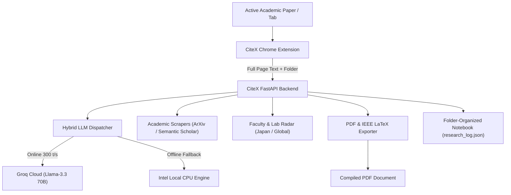

# CiteX

<p align="center">
  
  
  
  
  
  
</p>

> **CiteX** is an autonomous research assistant, literature synthesis engine, and citation compiler. It features a standalone desktop application and a tab-isolated Chrome extension that scrapes active academic papers and web context, synthesizes multi-section literature reviews, organizes research into editable topic folders, maps faculty research radars, and automatically compiles IEEE-formatted LaTeX and PDF drafts.

---

## Key Features

### 1. Hybrid Switchable Synthesis Engine
- **Groq Cloud Integration (Primary):** Powered by `llama-3.3-70b-versatile` delivering publication-grade synthesis, comparison matrices, and reasoning at 300+ tokens/second.
- **Intel Local Fast Engine (Automatic Fallback / Offline):** Operates on CPU architectures (including Intel Core Ultra / Lunar Lake) without requiring NVIDIA GPUs or external daemon setups. Guaranteed sub-3-second responses even when fully offline.

### 2. Tab-Isolated Chrome Research Extension
- In-page sliding drawer (Claude-style iframe architecture) docked on the active tab without global window pollution.
- Real full-page text extraction: Scrapes entire articles and preprints rather than saving shallow URL bookmarks.
- Multi-section academic synthesis with literature comparison matrices, BibTeX references, and direct PDF generation.
- Folder classification dropdown with inline creation of new destination folders.

### 3. Folder-Organized Research Notebook
- Structured categorizations (e.g., *Japan Universities Plan B*, *Event-Driven & AI Agents*, *General Research*).
- Inline editable folder names and document titles directly from the desktop UI.
- Persistent session storage in `research_log.json` and browser storage.

### 4. Generated Papers & IEEE PDF Hub
- Built-in ReportLab and IEEEtran LaTeX compiler producing two-column academic paper drafts and note summaries.
- Dedicated library view cataloging all compiled PDF artifacts with one-click local downloads.

### 5. Regional Faculty & Lab Radar
- Pre-mapped academic tracking for Japanese Imperial and National Research Institutes (Kyoto University, University of Tokyo, Tokyo Tech, Osaka University, NAIST, JAIST, Tohoku, etc.) to evaluate alignment with prospective supervisors.

---

## Technical Stack

- **Backend:** FastAPI, Python 3.11+, Pydantic v2
- **Document Compilers:** ReportLab (PDF Engine) and `IEEEtran` LaTeX Generator
- **Academic Scrapers:** Direct ArXiv Atom XML client and Semantic Scholar Graph API
- **Browser Extension:** Chrome Extension Manifest V3, Web Accessible Resources, PostMessage iframe bridge
- **Desktop UI:** Industrial Blueprint Design System, Marked.js Markdown Engine, Vanilla CSS

---

## System Architecture



---

## 🌐 Flexible Usage Modes

CiteX is modular and can be deployed according to your workflow:

1. **🌐 Hosted Web Application:**
   - Deploy the FastAPI backend to your cloud server (AWS, GCP, Railway, Render, Docker, or VPS).
   - Access the full research dashboard, literature matrix, and IEEE paper compilers from any browser on any device.
2. **💻 Local Standalone Desktop Application:**
   - Run completely offline on your PC with full privacy and zero token costs using the included desktop launcher (`launch_citex_app.bat` or Desktop shortcut).
   - Renders in a dedicated borderless application window powered by the local Intel CPU Fast Engine.
3. **🧩 Tab-Isolated Chrome Research Extension:**
   - Use as a lightweight in-page research assistant on Chrome, Brave, or Edge.
   - Summarizes preprints and articles, captures full-page context, compiles notes to PDF, and categorizes research into topic folders directly from your active browsing tab.

---

## Quickstart Guide

### 1. Clone & Install Dependencies
```bash
git clone https://github.com/Tamore/AI-Research-Agent.git
cd AI-Research-Agent
python -m venv venv
.\venv\Scripts\activate
pip install -r requirements.txt
```

### 2. Configure Environment (Optional)
Copy `.env.example` to `.env`:
```env
GROQ_API_KEY=your_groq_api_key_here  # Optional: upgrades synthesis to Llama 3.3 70B
```
*Note: If no API key is set, CiteX automatically runs in Intel Local Fast Engine mode with zero setup.*

### 3. Launch Desktop App
Run the launcher script or desktop shortcut:
```bash
.\launch_citex_app.bat
```
Or start the server directly:
```bash
python -m uvicorn app.main:app --port 8000 --reload
```

### 4. Install Chrome Extension
1. Open Google Chrome and navigate to `chrome://extensions`.
2. Enable **Developer mode** in the top right.
3. Click **Load unpacked** and select the `chrome_extension/` directory.

---

## API Specification

| Endpoint | Method | Description |
| :--- | :--- | :--- |
| `/` | `GET` | Serves the interactive Desktop Research Console |
| `/health` | `GET` | Reports engine connectivity (Groq Cloud / Intel Local Engine) |
| `/favicon.ico` | `GET` | Serves the CiteX logo icon |
| `/api/v1/research` | `POST` | Executes complete multi-step autonomous research pipeline |
| `/api/v1/notes/synthesize`| `POST` | Scrapes webpage text, produces detailed review, and compiles PDF |
| `/api/v1/notes/folders` | `GET` | Fetches research notebook entries grouped by folder |
| `/api/v1/folders/rename` | `POST` | Renames an existing topic folder |
| `/api/v1/notes/rename` | `POST` | Renames a specific note or document title |
| `/api/v1/papers` | `GET` | Retrieves compiled paper library catalog |
| `/api/v1/download-pdf` | `GET` | Serves compiled PDF drafts and research notes |

---

## License
Distributed under the **MIT License**.
